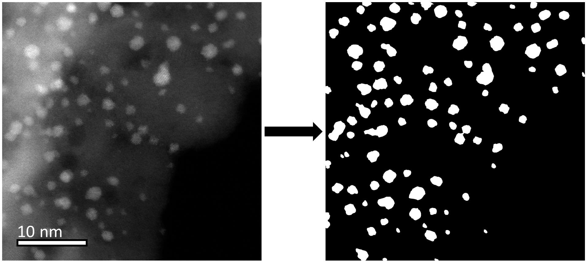

# Particle-segmentation

This repository contains code to analyze high-angle annular dark field STEM images of nanoparticles on support, where the support morphology causes a significant background signal, preventing conventional thresholding from filtering out the nanoparticles. The code was tested on images of small iridium nanoparticles on a ceramic support of varying thickness, an efficient catalyst for oxygen evolution reaction, one of the reactions in clean hydrogen production. 

The segmentation protocol analyzes images and returns binary masks with blobs representing nanoparticles. The blobs can later be analyzed in terms of area, perimeter, equivalent sphere diameter, and circularity. Helper functions to visualize the results in the form of histograms are available. 

If you use the code, please cite the following papers: 

* Iridium stabilizes ceramic titanium oxynitride support for oxygen evolution reaction. *ACS Catalysis* (2022). https://doi.org/10.1021/acscatal.2c04160
* “Nano Lab” Advanced characterization platform for studying electrocatalytic iridium nanoparticles dispersed on TiOxNy supports prepared on Ti transmission electron microscopy grids. *ACS Applied Nano Materials* (2023). https://doi.org/10.1021/acsanm.3c01368

Example of the particle segmentation:

  

